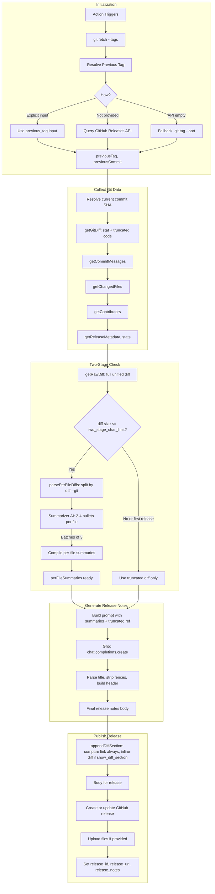

# How It Works

## High-Level Summary

1. **Fetches Git Information**: Gets all tags and determines the previous release tag (via `previous_tag` input, latest GitHub release, or git tags).
2. **Analyzes Changes**: Collects git diff, commit messages, and changed files between the tags.
3. **Two-Stage Summarization** (when diff is under `two_stage_char_limit`, default 40,000 chars): A separate AI pass summarizes changes *per file* in 2–4 bullet points; compiled summaries are passed to the final AI instead of the full diff. Keeps context manageable while capturing all changes.
4. **Generates Notes**: Sends diff (or per-file summaries), commit messages, and metadata to Groq's API to generate structured release notes.
5. **Creates Release**: Creates or updates the GitHub release, appends the diff section at the bottom (if enabled), and attaches any specified files.

## Detailed Flow

## Step-by-Step Breakdown

| Phase | Step | Description |
|-------|------|-------------|
| **Initialization** | Resolve previous tag | Uses `previous_tag` if provided; otherwise fetches latest release from GitHub API (respecting channel for `v1.0.0-beta`-style tags); falls back to `git tag --sort=-version:refname` if API returns nothing. |
| | Resolve current commit | `git rev-parse tag_name` (or `HEAD` if tag does not exist yet). |
| **Collect** | Diff | `getGitDiff` returns stat + truncated code diff (respects `diff_limit`). Used for AI prompt in non–two-stage mode. |
| | Commits | `git log --pretty=format:"%h - %s (%an)"` truncated by `commits_limit`. |
| | Files & contributors | Changed file list, contributor sets for current vs previous range (to detect new contributors). |
| **Two-Stage** | Raw diff | Full `git diff prev..curr` for size check and parsing. |
| | Threshold | If `two_stage_char_limit > 0` and `rawDiff.length <= limit`, run two-stage. |
| | Parse | Split unified diff by `diff --git a/path b/path` into per-file chunks. |
| | Summarize | For each file (batches of 3): call Groq with `summarizer_model`, get 2–4 bullet points. Per-file diff capped at 8k chars. |
| | Compile | Format: `**path**:\n- bullet\n\n**path2**:\n- ...` |
| **Generate** | Prompt | If summaries exist: per-file summaries as primary, truncated diff as reference. Else: truncated diff only. Plus commits, changed files, metadata. |
| | Groq | Single chat completion with system + user messages. |
| | Parse | Extract "Release Title:", strip markdown fences, prepend header with metadata. |
| **Publish** | Diff section | Always append `## Changes (diff)` and GitHub compare link (when prev tag exists). If `show_diff_section`: also append inline diff (truncated by `diff_section_limit` lines). |
| | Release | Create or update release via GitHub API, upload files, set outputs. |
